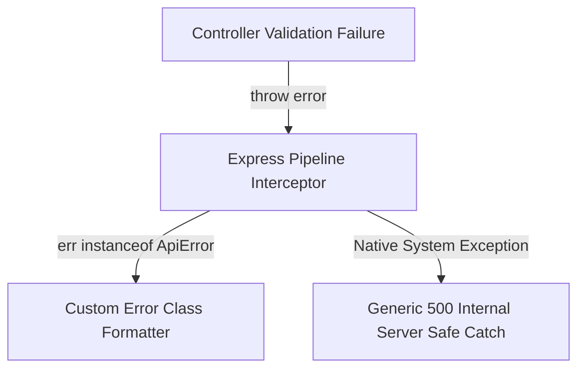

# HTTP POST Method & Advanced Error Architecture 📥

The `POST` method is used to submit new payloads to the server to create a new resource. This lab highlights data validation, middleware ingestion, and specialized **Global Exception Handling** via custom Error classes.

---

## 🏗️ Technical Highlights

1. **Dual Ingestion Engine:** Utilizes both `express.json()` and `express.urlencoded()` to process data cleanly from either client-side API clients or standard HTML Form-urlencoded submissions.
2. **Decoupled Error Flow:** Leverages specialized error classes (`BadRequestError`) to separate validation rules from routing responses, relying entirely on a centralized Express global handler to manage server outcomes.
3. **Temporal Dead Zone Testing:** Includes internal evaluation of standard JavaScript compilation scoping errors (like block-scoped `let` runtime constraints).

---

## 💻 Code Implementation (`ExploreMethods/POST/PostMethod.js`)

```javascript
const express = require('express');
const router = express.Router();
const users = require('../../data/usersData'); // Shared state database layer
const { BadRequestError } = require('../../core/ApiError'); // Custom Object-Oriented Error Handling

router.post('/api/users', (req, res) => {
    const { name } = req.body;

    // 1. Structural Data Validation
    if (!name) {
        // Decoupled from res.status(): Handled cleanly by centralized app middleware
        throw new BadRequestError('Name field is required -- Custom Error');
    }

    // 2. Controlled Runtime Scope Validation (TDZ Simulation)
    if (true) {
        // Simulates: Cannot access variable before initialization
        console.log(a); 
        let a = 100; 
    }

    // 3. Resource Generation & State Mutation
    const newUser = {
        id: users.length + 1,
        name: name
    };
    users.push(newUser);

    // 4. Return REST-compliant Success Status (201 Created)
    res.status(201).json({
        message: "User created successfully!",
        data: newUser
    });
});

module.exports = router;
```

---

## 🛡️ Error Lifecycle & Evaluation

When validation fails or a code exception hits, the controller hands execution off to a centralized structure:



### Expected API Responses

#### 🔴 Client Validation Failure (`400 Bad Request`)
Triggered when the name property payload is blank or undefined.
```json
{
  "status": "failed",
  "message": "Name field is required",
  "data": null
}
```

#### 🔴 System Hoisting Scope Crash (`500 Internal Server Error`)
Triggered when the code attempts to call `console.log(a)` before the variable block is allocated.
```json
{
  "status": "failed",
  "message": "Cannot access 'a' before initialization",
  "data": null
}
```
**instead of the above you will get the below one(The custom error handler)**
```json
{
  "status": "failed",
  "message": "Best mind working on it!",
  "data": null
}
```

---

## 🛠️ Execution Blueprint

* **Target URL:** `http://localhost:8000/api/users`
* **HTTP Verb:** `POST`
* **Supported Payloads:** `application/json` or `application/x-www-form-urlencoded`
